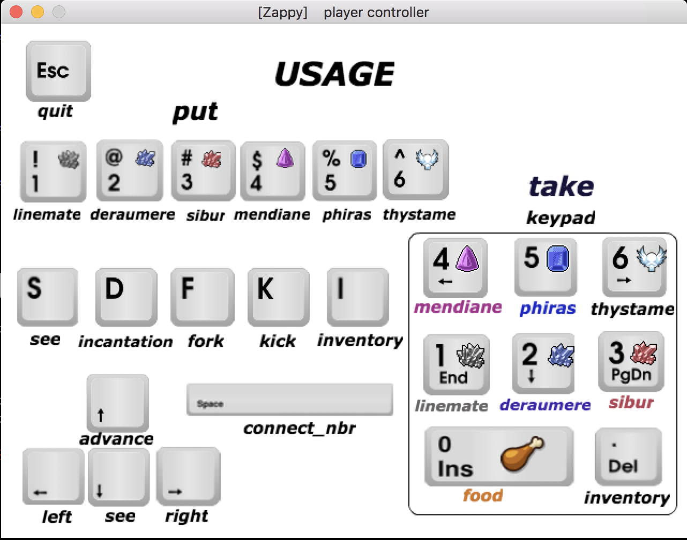

# Zappy 🎮💫

A multi-players, single process and single thread game within a TCP/IP network 🤖
* **Techinal part**: Zappy is a team project consisting of 3 people creating a world with resources (**the server** written in **C**) with complex AIs (**the clients** written in Python) that have personalities and actions. Server-client and client-client interactions happen through the server on a TCP/IP network which is displayed on **a graphical interface** (written in python). The game servers may only utilize **a SINGLE PROCCESS within a SINGLE THREAD**. Interesting parts about Zappy's technical part I'd like to mention about:
  
  
 
  * We **MAXIMALLY REDUCED MALLOC CALLS** by initializing one global buffer capable enought to hold all required data within entire game, from the beginning till the end.
  * A time unit taken into consideration in **Event Driven Engine** allows to choose game speed (`-t <timeunit>` while executing server binary). The greater time unit, the faster game goes, and everything happens in real time...
  * We implemented a **customized priority queue** for the **event engine**. (also implement **circular buffer for each player action's queue** on second version)
  * Thanks to the use of `t_player g_players[MAX_FD];` array and player's assagnition based on its fd, we guarantee **O(1) access to all players' data** .

  </br>
* **Fun part**: Zappy is about creating families, surviving by eating food and collecting stones in order to level up. Each level has different requirements for a ritual, which makes the adventure more and more difficult for the AI players, which play on their own, without any help form their creator. The game is over once 6 members of one family reach the highest possible level (8). 
</br></br>

# Code Highlight from entire game
```
file: zappy/server/src/socket/s_utils.c

struct timeval	*set_timeout_alarm(void)
{
	long int		time_diff;
	struct timeval	*timeout;
	struct timeval	now;

	timeout = (struct timeval *)malloc(sizeof(struct timeval));
	if (g_env.queue_head)
	{
		gettimeofday(&now, NULL);
		time_diff = (g_env.queue_head->exec_time.tv_sec - now.tv_sec) * 1000000
			+ (g_env.queue_head->exec_time.tv_usec - now.tv_usec);
		if (time_diff <= 0)
			bzero(timeout, sizeof(struct timeval));
		else
		{
			timeout->tv_sec = time_diff / 1000000;
			timeout->tv_usec = time_diff % 1000000;
		}
	}
	if (!g_env.queue_head || time_diff > g_env.ms_pre_tick)
	{
		timeout->tv_sec = g_env.ms_pre_tick == 1000000 ? 1 : 0;
		timeout->tv_usec = g_env.ms_pre_tick == 1000000 ? 0 : g_env.ms_pre_tick;
	}
	return (timeout);
}
```


</br></br>

# How to run Zappy?
Note: Run the following command lines in terminal
### Download the project:
```
git clone https://github.com/jding05/zappy.git Zappy
cd Zappy
make
```
### Start the Server: 
1. Open a window and **run the server** under server's usage:
```
cd server
./server -p <port> -x <width> -y <height> -n <team> [<team>] [<team>] ... -c <nb> -t <t>
   -p port number,
   -x world width,
   -y world heigh,
   -n team\_name\_1 team\_name\_2 ...
   -c number of clients authorized at the beginning of the game,
   -t time unit divider (the greater t is, the faster game will go).
```
* for example you can run this line to execute a basic server on command line
```
./server -p 4242 -x 6 -y 6 -n team1 team2 -c 12 -t 100
```
</br>

### Try our clients [ AI / Human Manual] :
2. Run an **AI Client**, you can use ours, here's how:
```
cd ai
python main.py
```
* PS: you need to have **python 2.7** installed
</br>

3. Run an **Human Client**, if you want to play our game:
```
cd python_client
python python_client.py -n c -p 4242

```
* PS 1: you need to have **python 2.7** installed, **pygame 1.9.4** installed
* PS 2: to start the player window: click/select the pop up window and pressed **Enter** 


</br>

### Monitor the whole game [User Interface / GUI]:
4. Add gui client; in new window:
```
  cd gfx
  python main.py
```
* PS 1: you need to have **python 2.7** installed, **pygame 1.9.4** installed
* PS 2: to start the monitor window: click/select the pop up window and pressed **Enter**

## Rules:
* Each player starts with 10 food (1260 time units) and 0 stones,
* Each player starts on level 1,
* The higher level, the more in sight,
* One food == 126 time units,
* Eat to not starve, collect stones to level up,
* Hatch an egg if you need a spot in your family,
* Create family of (at least) 6 and win the game.
</br></br>

## Commands

Each player is allowed to use following commands:

| Command | Time | Description |
|:-:|:-:|:-:|
| advance | 7 | advance one square |
| left | 7 | turn 90 degrees left |
| right | 7 | turn 90 degrees right |
| see | 7 | see what's in your sight |
| inventory | 1 | look into your inventory |
| take <object> | 7 | take an object to your inventory |
| put <object> | 7 | drop an object from your inventory |
| kick | 7 | kick the players form your square |
| broadcast <text> | 7 | send a message to all players |
| incantation | 300 | begin the ritual of incantation |
| fork | 42 | lay an agg and create additional spot in a family |
| connect_nbr | 0 | number of unused connection within a family |
 
 </br>
  
## Incantaion
In order to win you and your family member have to achieve level 8 (at least 6 family members) by collection stones and having an incantation ritual. These stones have 6 distinct kinds: linemate, deramere, sibur, mendiane, phiras and thystame.
Each level has different ritual requirements:

| Level | Number of players | Linemate | Deraumere | Sibur | Mendiane | Phiras | Thystame |
|:-:|:-:|:-:|:-:|:-:|:-:|:-:|:-:|
| 1-2 | 1 | 1 | 0 | 0 | 0 | 0 | 0 |
| 2-3 | 2 | 1 | 1 | 1 | 0 | 0 | 0 |
| 3-4 | 2 | 2 | 0 | 1 | 0 | 2 | 0 |
| 4-5 | 4 | 1 | 1 | 2 | 0 | 1 | 0 |
| 5-6 | 4 | 1 | 2 | 1 | 3 | 0 | 0 |
| 6-7 | 6 | 1 | 2 | 3 | 0 | 1 | 0 |
| 7-8 | 6 | 2 | 2 | 2 | 2 | 2 | 1 |

</br>

## Made by
| | |
|:-:|:-:|
|🇺🇸[Ziyan Feng](https://github.com/ziyanfeng) | Server/client |
|🇺🇸[Jeff Ding](https://github.com/jding05) | Server/client |
|🇺🇸[Xuan Zhu](https://github.com/xlz447) | Gui/ai |
| | |
</br>
